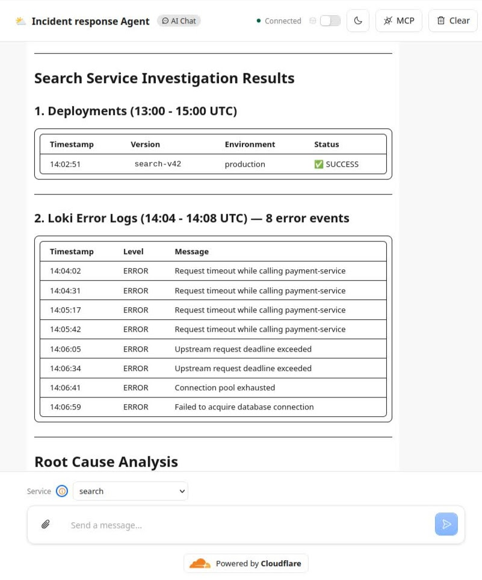
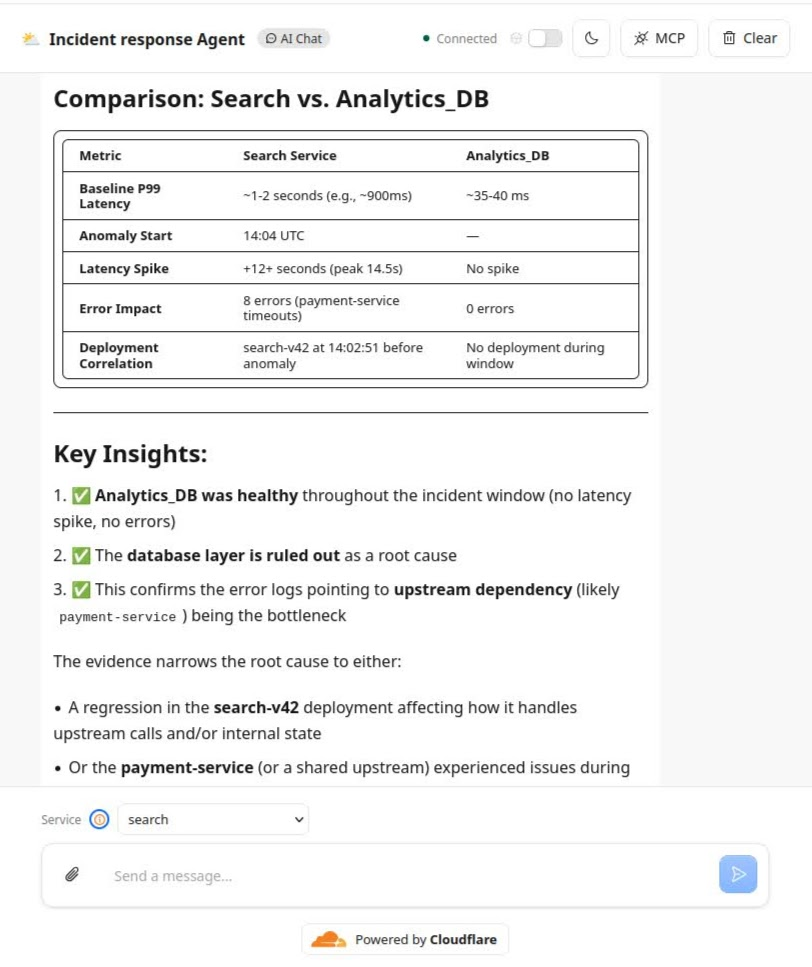
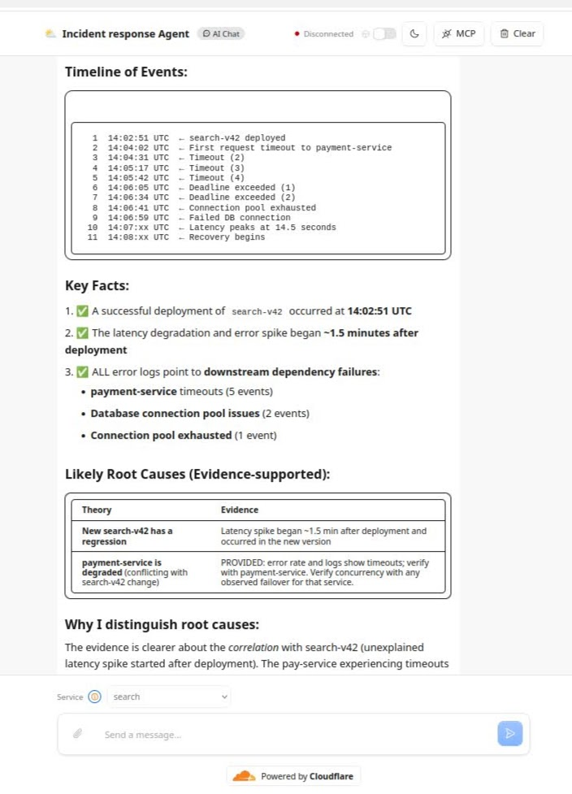

## Incident Investigator

AI-powered incident investigation agent that uses service telemetry to identify anomalies, correlate failures, and determine likely root causes.

### Methodology

The agent follows this:

1. Get all services that are there in the ecosystem.
2. Identify the incident window.
3. Establish a baseline for affected services.
4. Detect anomalous metrics.
5. Inspect dependent services.
6. Form and validate hypotheses using additional telemetry.
7. Generate a summary with supporting evidence and confidence.

The agent can perform multiple tool calls, allowing each investigation step to influence the next.

The LLM is responsible for reasoning, while tools provide access to telemetry.

Visit here:
https://incident-investigator.sankalp-jain02.workers.dev/

### Assumptions

1. The agent works on data stored in D1. The data includes mock logs, prometheus data points, scaling events, deployments etc.
2. As the mock data is tied to a specific time, the chat agent assumes some time close to the mock data and operates on that. This way queries like last 10 hours, latency over last 10 minutes can work.
3. At the bottom of the UI, we provide a service list which can be used to check metrics for a particular service.

### Screenshots

### [Conversation with the agent](docs/sample_run.txt)